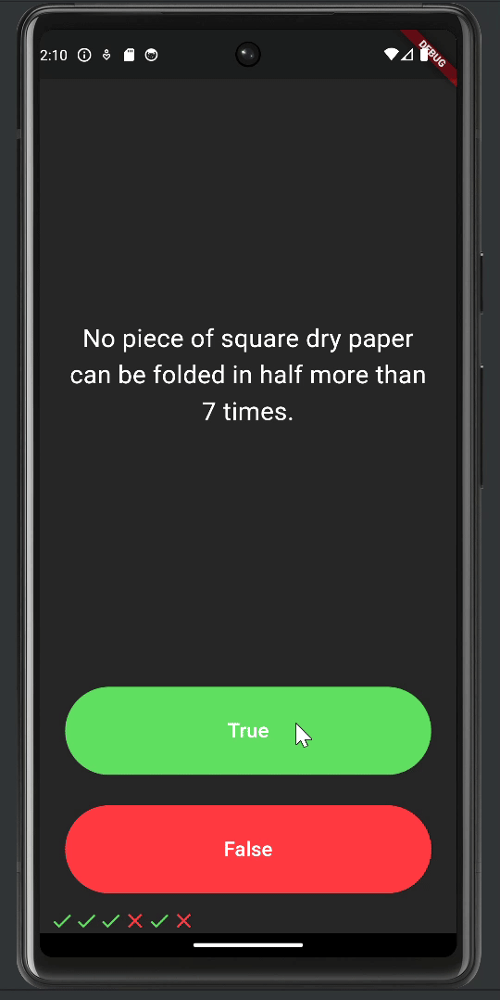

# Quizzler Flutter

Quizzler Flutter is a quiz app developed as part of Angela Yu's Udemy course, "The Complete Flutter Development Bootcamp with Dart." This project demonstrates the usage of Object-Oriented Programming (OOP) principles and integrates the `rflutter_alert` package for alert dialogs.

## Table of Contents

- [Introduction](#introduction)
- [Features](#features)
- [Demo](#demo)
- [Usage](#usage)

## Introduction

Quizzler Flutter is a simple and interactive quiz app where users are presented with a series of questions and must choose either true or false by pressing the corresponding button. The app uses a scorekeeper to track the user's answers and display whether they are correct or incorrect using icons. When the user has answered all the questions, a floating message informs them, and they can restart the quiz by clicking cancel.

## Features

- Demonstrates Object-Oriented Programming (OOP) principles in Flutter.
- Utilizes the `rflutter_alert` package for user alerts.
- Interactive UI with true/false buttons for answering questions.
- Scorekeeper line with icons to indicate right or wrong answers.
- Floating message to inform users when they have completed all the questions.
- Option to restart the quiz after completion.

## Demo

## Usage

1. Open the app.
2. Read the question displayed on the screen.
3. Press the **True** or **False** button to answer the question.
4. The scorekeeper line will update with an icon indicating whether your answer was correct or incorrect.
5. Continue answering questions until you reach the end.
6. When all questions are answered, a floating message will inform you that the quiz is over.
7. Click **Cancel** in the alert to restart the quiz.

